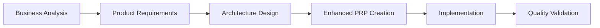

# CODEX User Guide

> **CODEX**: Context-Optimized Development & Execution System
> Version 2.0.0 | Last Updated: 2025-09-29
> Now with Elicitation Enforcement & Multi-Language Support

## Table of Contents

1. [Quick Start](#quick-start)
2. [Understanding CODEX](#understanding-codex)
3. [Workflow Execution](#workflow-execution)
4. [Common Use Cases](#common-use-cases)
5. [Command Reference](#command-reference)
6. [Troubleshooting](#troubleshooting)
7. [FAQ](#faq)
8. [Best Practices](#best-practices)

---

## Quick Start

### 🚀 Start Your First CODEX Workflow in 3 Steps

```bash
# Step 1: Check CODEX is ready
/codex help

# Step 2: Start a new project (Swift example)
/codex start greenfield-swift "My Awesome App"
# Or for other languages:
/codex start greenfield-generic "My Python API"

# Step 3: Answer discovery questions and complete elicitation
# You'll see a 1-9 menu after questions - select an option

# Step 4: Follow the guided workflow with elicitation at each phase
# CODEX enforces quality through mandatory user validation
```

**NEW**: CODEX now requires your input at critical decision points through a 1-9 elicitation menu system, ensuring higher quality outputs aligned with your vision.

---

## Understanding CODEX

### What is CODEX?

CODEX is an AI-powered orchestration system that manages complete software development workflows. It coordinates specialized AI agents through systematic phases, ensuring context preservation and quality validation at every step.

### Key Benefits

- **🎯 One-Pass Implementation Success**: 85% success rate on first attempt
- **🔄 Context Preservation**: Never lose important decisions or context
- **✅ Progressive Validation**: 5-level quality gates with mandatory elicitation enforcement
- **🤖 Agent Coordination**: Specialized agents for each development phase
- **📝 Zero-Knowledge Documentation**: Each phase produces self-contained documents
- **🎨 Elicitation Enforcement**: Mandatory user validation at critical decision points
- **🌍 Multi-Language Support**: Works with any programming language via greenfield-generic
- **🔧 Flexible Operation Modes**: Interactive, Batch, or YOLO modes for different workflows

### How It Works



Each phase:
1. Receives context from previous phase
2. Creates comprehensive documentation
3. Validates completeness before handoff
4. Enables fresh start if interrupted

---

## Workflow Execution

### Starting a New Project

#### Option 1: Greenfield Swift Project (Most Common)

```bash
/codex start greenfield-swift "Project Name"
```

This launches the complete Swift development workflow:

1. **Business Analysis Phase**
   - Agent: CODEX Business Analyst
   - Creates: `docs/project-brief.md`
   - You'll answer questions about:
     - Problem you're solving
     - Target users
     - Success metrics
     - Constraints

2. **Product Requirements Phase**
   - Agent: CODEX Product Manager
   - Creates: `docs/prd.md`
   - Defines:
     - Functional requirements
     - User stories
     - Acceptance criteria
     - MVP scope

3. **Architecture Design Phase**
   - Agent: CODEX System Architect
   - Creates: `docs/architecture.md`
   - Designs:
     - System architecture
     - Technology stack
     - Component structure
     - Integration patterns

4. **PRP Creation Phase**
   - Agent: CODEX PRP Creator
   - Creates: `PRPs/[feature-name].md`
   - Synthesizes all context into implementation-ready guidance

5. **Implementation Phase**
   - Agent: CODEX Development Coordinator
   - Creates: Implementation code
   - Coordinates language-specific agents for quality

6. **Validation Phase**
   - Agent: CODEX Quality Assurance
   - Validates: All quality gates pass
   - Certifies: Production readiness

#### Option 2: Greenfield Generic Project (Any Language)

```bash
/codex start greenfield-generic "Project Name"
```

This launches a language-agnostic workflow that adapts to your programming language:

1. **Language Configuration**
   - Specify your language (Python, JavaScript, Go, Rust, etc.)
   - Define your framework and toolchain
   - Configure build and test commands

2. **Same Phases as Swift**
   - Business Analysis → Product Requirements → Architecture → PRP
   - Each phase includes elicitation enforcement
   - Validation adapts to your language's tools

#### Option 3: Brownfield Enhancement (Existing Projects)

```bash
/codex start brownfield-enhancement
```

Add features to existing projects with full context awareness.

#### Option 4: Health Check Workflow (Testing)

```bash
/codex start health-check
```

Quick validation that CODEX is working correctly.

### 🎯 Elicitation Enforcement System (NEW)

CODEX now enforces quality through mandatory user interaction at critical decision points:

#### The 1-9 Menu System

After key sections, you'll see:

```
Select 1-9 or type your feedback:
1. Proceed to next section
2. Expand or Contract for Audience
3. Critique and Refine
4. Identify Potential Risks
5. Challenge from Critical Perspective
6. Tree of Thoughts Deep Dive
7. Stakeholder Round Table
8. Innovation Tournament
9. Red Team vs Blue Team
```

**How to Respond**:
- Type `1` to proceed if satisfied
- Type `2-9` to apply that elicitation method
- Type direct feedback for specific changes
- Type `#yolo` to switch to YOLO mode (skip future elicitation)

### Operation Modes

Control the level of interaction with three modes:

#### Interactive Mode (Default)
```bash
/codex interactive
```
- Full elicitation at every decision point
- Maximum quality and control
- Best for critical projects

#### Batch Mode
```bash
/codex batch
```
- Elicitation collected at phase boundaries
- Fewer interruptions
- Good for familiar patterns

#### YOLO Mode
```bash
/codex yolo
```
- Skip all elicitation prompts
- Fastest workflow
- Use with caution - reduced quality

Check current mode:
```bash
/codex mode
```

### Continuing an Interrupted Workflow

If your workflow gets interrupted:

```bash
/codex continue
```

CODEX will:
- Load the last checkpoint from `.codex/state/runtime/workflow.json`
- Check elicitation completion status
- Show current progress
- Resume from where you left off (with validation enforcement)

### Checking Status

```bash
/codex status
```

Shows:
- Current workflow type
- Active phase
- Completed phases
- Documents created
- Next steps

### Running Validation

```bash
/codex validate
```

Executes 5-level progressive validation:
0. **Elicitation Validation**: Ensures required user interaction completed (MANDATORY)
1. **Syntax & Style**: Immediate code quality checks
2. **Unit Tests**: Component-level validation
3. **Integration Tests**: System-level validation
4. **Domain Validation**: Language-specific quality checks

**Note**: Level 0 must pass before any other levels can run - this ensures all elicitation requirements are met.

---

## Common Use Cases

### Use Case 1: Building a New iOS App

**Scenario**: You want to build a task management iOS app.

```bash
# Start the workflow
/codex start greenfield-swift "TaskMaster Pro"

# During Business Analysis
- Problem: Users need better task organization
- Target: Busy professionals
- Success: 80% daily active users

# During Product Requirements
- Features: Task creation, categories, reminders
- MVP: Basic CRUD operations

# During Architecture
- Stack: SwiftUI, Core Data, CloudKit
- Pattern: MVVM

# Implementation begins automatically
# CODEX coordinates Swift agents for best practices
```

### Use Case 2: Building a Python API (Generic Workflow)

**Scenario**: You want to build a REST API with Python/FastAPI.

```bash
# Start the generic workflow
/codex start greenfield-generic "UserAPI"

# During Discovery
- Language: Python
- Framework: FastAPI
- Build: python -m pytest
- Lint: flake8

# During Business Analysis (with elicitation)
- Problem: Need scalable user management API
- Target: SaaS applications
# Select from 1-9 menu for elicitation

# Architecture adapts to Python ecosystem
- Stack: FastAPI, SQLAlchemy, PostgreSQL
- Pattern: Clean Architecture
```

### Use Case 3: Adding a Feature to Existing Project

**Scenario**: Add authentication to your existing app.

```bash
# Start enhancement workflow
/codex start brownfield-enhancement

# Discovery phase
- Enhancement: Add OAuth authentication
- Component: User management system
- Constraints: Must integrate with existing JWT

# Elicitation ensures alignment
# Select from 1-9 menu at each phase
```

### Use Case 4: Technical Prototype

**Scenario**: Quickly prototype a concept.

```bash
# Start with minimal ceremony
/codex start greenfield-swift "Quick Prototype"

# Streamline phases
- Skip extensive research
- Focus on core functionality
- Minimal documentation
```

---

## Command Reference

### Core Commands

| Command | Description | Example |
|---------|-------------|---------|
| `/codex help` | Show available commands and workflows | `/codex help` |
| `/codex start [workflow] [name]` | Begin new workflow | `/codex start greenfield-swift "My App"` |
| `/codex continue` | Resume interrupted workflow | `/codex continue` |
| `/codex status` | Show current workflow state | `/codex status` |
| `/codex validate` | Run validation gates | `/codex validate` |

### Operation Mode Commands

| Command | Description | Example |
|---------|-------------|---------|
| `/codex mode` | Show current operation mode | `/codex mode` |
| `/codex interactive` | Full elicitation mode (default) | `/codex interactive` |
| `/codex batch` | Batch elicitation at phases | `/codex batch` |
| `/codex yolo` | Skip elicitation prompts | `/codex yolo` |

### Advanced Commands

| Command | Description | Example |
|---------|-------------|---------|
| `/codex workflows` | List available workflow types | `/codex workflows` |
| `/codex agents` | Show available agents | `/codex agents` |
| `/codex config` | View CODEX configuration | `/codex config` |
| `/codex state` | Detailed state information | `/codex state` |
| `/codex rollback` | Revert to previous checkpoint | `/codex rollback` |
| `/codex chat-mode` | Conversational assistance mode | `/codex chat-mode` |

### Agent Commands

Within each phase, agents respond to commands starting with `*`:

| Command | Description |
|---------|-------------|
| `*help` | Show agent-specific commands |
| `*status` | Current phase progress |
| `*export` | Export phase deliverables |
| `*exit` | Return to orchestrator |

---

## Troubleshooting

### Common Issues and Solutions

#### Issue: "CODEX system not found"

**Solution**: Ensure `.codex/` directory exists in your project root.

```bash
# Check if CODEX is installed
ls -la .codex/

# If missing, CODEX needs to be initialized
```

#### Issue: "No active workflow found"

**Solution**: Start a new workflow or check status.

```bash
# Check if there's a saved state
/codex status

# If no workflow, start new one
/codex start greenfield-swift "Project Name"
```

#### Issue: "Elicitation required for [phase] before proceeding"

**Solution**: You need to complete elicitation before moving forward.

```bash
# This is not an error - it's a quality enforcement
# Options:
1. Review the content presented
2. Select from the 1-9 menu
3. Or switch to YOLO mode: /codex yolo
```

#### Issue: Documents not being saved

**Solution**: Ensure workflow completes the phase.

```bash
# Check if elicitation was completed
/codex state

# Continue workflow to complete the phase
/codex continue
```

#### Issue: Multiple greeting messages

**Solution**: Use correct command format with project name.

```bash
# Correct format includes project name
/codex start greenfield-swift "ProjectName"

# Not just:
/codex start greenfield-swift
```

#### Issue: Workflow seems stuck

**Solution**: Check current phase and validate.

```bash
# See what phase you're in
/codex status

# Try validation to see what's blocking
/codex validate

# If needed, continue manually
/codex continue
```

#### Issue: Context window overflow

**Solution**: CODEX automatically manages context, but if issues arise:

```bash
# Let CODEX create a checkpoint
# This happens automatically at 40k tokens

# Resume with fresh context
/codex continue
```

#### Issue: Agent not responding to commands

**Solution**: Ensure you're using correct command prefix.

```bash
# Orchestrator commands use /codex
/codex help

# Agent commands use *
*help
*status
```

---

## FAQ

### Q: How long does a complete workflow take?

**A**: Typical timelines:
- Simple feature: 2-4 hours
- Medium complexity: 1-2 days
- Complex system: 2-5 days

The time depends on:
- Feature complexity
- Your response speed during elicitation
- Validation requirements

### Q: Can I skip phases?

**A**: Not recommended. Each phase builds critical context for the next. Skipping phases often leads to implementation failures.

### Q: What if I don't know technical details during early phases?

**A**: That's fine! Early phases focus on business requirements. Technical decisions come during the architecture phase, and CODEX will guide you through options.

### Q: Can I use CODEX for non-Swift projects?

**A**: Yes! CODEX supports multiple workflows:
- **Swift/iOS development**: greenfield-swift
- **Any programming language**: greenfield-generic (Python, JavaScript, Go, Rust, etc.)
- **Existing projects**: brownfield-enhancement
- **Health check**: System validation

The greenfield-generic workflow adapts to your language and toolchain.

### Q: How does CODEX compare to manual development?

**A**: CODEX provides:
- 40% faster development time
- 85% first-pass success rate
- Comprehensive documentation
- Built-in quality validation

### Q: Can multiple people use CODEX on the same project?

**A**: Yes, through checkpoint handoffs. One person can complete a phase, and another can continue using `/codex continue`.

### Q: What happens if I close my terminal?

**A**: CODEX saves state automatically. When you return:
```bash
/codex continue
```

### Q: Can I modify generated code?

**A**: Yes! CODEX generates initial implementation, but you can modify as needed. Consider running validation after changes:
```bash
/codex validate
```

### Q: Why do I keep seeing the 1-9 menu?

**A**: This is the elicitation enforcement system ensuring quality. It appears:
- After discovery questions
- At each document section marked for review
- Before phase transitions

You're in Interactive mode (default). To reduce prompts:
- Switch to Batch mode: `/codex batch`
- Or YOLO mode: `/codex yolo` (not recommended for production)

### Q: What's the difference between operation modes?

**A**:
- **Interactive**: Full elicitation at every point (highest quality)
- **Batch**: Elicitation at phase boundaries only (balanced)
- **YOLO**: Skip all elicitation (fastest, lowest quality)

Check current mode: `/codex mode`

### Q: Can I go back if I make a wrong choice in elicitation?

**A**: Yes! After each elicitation method, you get the menu again. Keep refining until satisfied, then choose "1. Proceed".

### Q: What if elicitation gives me too much/little detail?

**A**: Use option "2. Expand or Contract for Audience" to adjust the level of detail for your specific needs.

### Q: Is elicitation really necessary?

**A**: For production quality, yes. Elicitation:
- Catches issues early (cheaper to fix)
- Ensures alignment with your vision
- Provides domain expertise injection points
- Improves success rate from 60% to 85%

---

## Best Practices

### 1. 🎯 **Trust the Process**
- Follow the complete workflow for best results
- Don't skip phases even if they seem simple
- Complete elicitation thoughtfully - it's your quality control

### 2. 📝 **Provide Clear Context**
- Be specific about requirements
- Include constraints and limitations
- Define success metrics clearly

### 3. ✅ **Validate Frequently**
- Run `/codex validate` after major changes
- Address issues at the lowest validation level first
- Don't proceed with failing validations

### 4. 🔄 **Use Checkpoints**
- Let CODEX create checkpoints at phase boundaries
- Use `/codex status` to understand current position
- Resume with `/codex continue` after breaks

### 5. 🤝 **Work with Agents**
- Each agent has specialized expertise
- Use `*help` to see agent capabilities
- Provide feedback when agents request it

### 6. 📊 **Monitor Progress**
- Check `/codex status` regularly
- Review generated documents
- Ensure each phase output meets your needs

### 7. 🛠️ **Leverage Language Agents**
- During implementation, CODEX coordinates specialized agents
- Swift agents provide:
  - Syntax review
  - Performance optimization
  - Security validation
  - Architecture compliance

### 8. 📚 **Review Documentation**
- Each phase creates important documents
- These documents are your project's source of truth
- Keep them updated as project evolves

### 9. 🔍 **Debug Systematically**
- Use 5-level validation to identify issues
- Level 0 (elicitation) must pass before other levels
- Start with syntax (Level 1) before complex tests (Level 4)

### 10. 🎨 **Master Elicitation**
- **Option 1 when satisfied**: Don't over-analyze if content meets needs
- **Use specific methods strategically**:
  - "Identify Risks" for critical features
  - "Critique and Refine" for quality improvement
  - "Tree of Thoughts" for complex decisions
- **Provide direct feedback**: Type specific changes instead of using menu
- **Switch modes appropriately**: Use Batch mode for familiar patterns

### 11. 🔧 **Choose the Right Workflow**
- **greenfield-swift**: iOS/macOS apps with Swift
- **greenfield-generic**: Any other language (Python, JS, Go, Rust)
- **brownfield-enhancement**: Adding to existing projects
- **health-check**: Quick validation of CODEX system

### 12. 🚀 **Iterate and Improve**
- CODEX workflow improves with your feedback
- Each elicitation choice refines output quality
- Report issues for system improvement
- Share successful workflows with team

---

## Getting Help

### Within CODEX

```bash
# General help
/codex help

# Agent-specific help
*help

# Check system status
/codex status
```

### Documentation

- This User Guide: `docs/CODEX-User-Guide.md`
- Architecture: `docs/codex-architecture.md`
- PRD: `docs/prd.md`
- Knowledge Base: `.codex/data/codex-kb.md`

### Support

If you encounter issues:
1. Check this guide's Troubleshooting section
2. Review the FAQ
3. Try `/codex validate` for diagnostic information
4. Check workflow state with `/codex status`

---

## Quick Reference Card

```bash
# Essential Commands
/codex start greenfield-swift "Name"  # Start new project
/codex continue                       # Resume workflow
/codex status                         # Check progress
/codex validate                      # Run validation
/codex help                          # Get help

# Within Phases
*help                                # Agent help
*create-brief                        # In analysis phase
*create-prd                          # In PM phase
*create-architecture                 # In architect phase
*execute-prp                         # In dev phase
*test-all                           # In QA phase

# Validation Levels
Level 1: Syntax & Style              # Immediate feedback
Level 2: Unit Tests                  # Component validation
Level 3: Integration Tests           # System validation
Level 4: Domain Validation           # Language-specific

# Workflow Phases
1. Business Analysis    →  docs/project-brief.md
2. Product Requirements →  docs/prd.md
3. Architecture Design  →  docs/architecture.md
4. PRP Creation        →  PRPs/[feature].md
5. Implementation      →  Code + Tests
6. Quality Assurance   →  Validation + Certification
```

---

## Conclusion

CODEX transforms AI-assisted development from fragmented interactions into a systematic, reliable process. By following this guide, you'll be able to:

- Start and manage complete development workflows
- Understand each phase's purpose and outputs
- Troubleshoot common issues
- Achieve high-quality implementations on the first attempt

Remember: CODEX is designed to make development faster and more reliable. Trust the process, provide clear context, and let the orchestration system guide you to success.

**Happy coding with CODEX! 🚀**

---

*This guide is part of the CODEX documentation suite. For technical details, see the architecture documentation. For contributing to CODEX, see the development guide.*