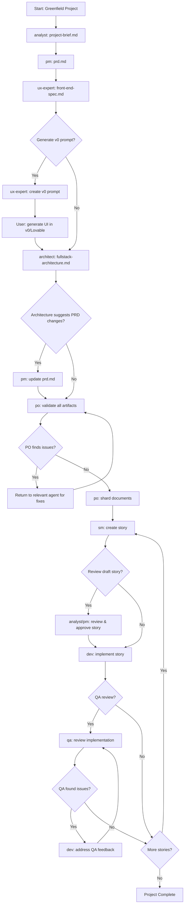
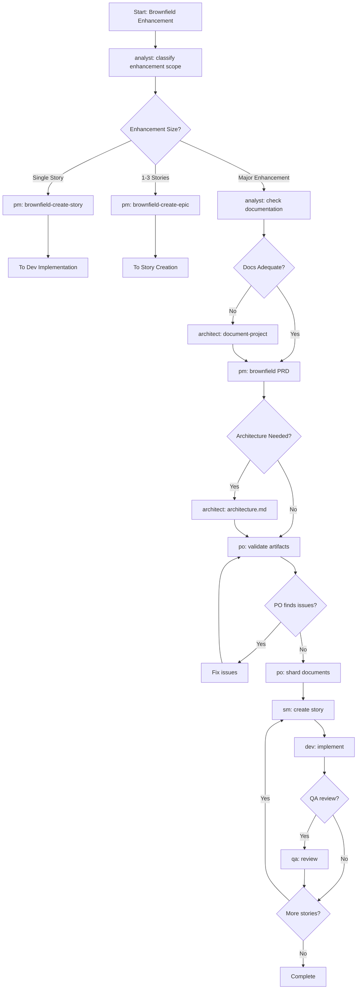

# BMAD Workflow Execution Model - Comprehensive Analysis

## Executive Summary

BMAD (Breakthrough Method of Agile AI-driven Development) implements a sophisticated workflow execution model that orchestrates specialized AI agents through structured development phases. The system uses YAML-defined workflows, state management, template-driven document generation, and a hybrid web/IDE architecture to enable complete project development from concept to implementation.

## 1. Workflow Definition and Structure

### 1.1 YAML-Based Workflow Definitions

Workflows are defined as YAML files in `.bmad-core/workflows/` with a standardized structure:

**Core Workflow Metadata:**
```yaml
workflow:
  id: greenfield-fullstack
  name: Greenfield Full-Stack Application Development
  description: >-
    Agent workflow for building full-stack applications from concept to development
  type: greenfield  # or brownfield
  project_types:
    - web-app
    - saas
    - enterprise-app
```

**Sequence Definition:**
```yaml
sequence:
  - agent: analyst
    creates: project-brief.md
    optional_steps:
      - brainstorming_session
      - market_research_prompt
    notes: "Guidance for agent execution"

  - agent: pm
    creates: prd.md
    requires: project-brief.md
    notes: "Creates PRD from project brief using prd-tmpl"
```

### 1.2 Workflow Types

BMAD provides six core workflow types:

**Greenfield Workflows:**
- `greenfield-fullstack.yaml` - Complete web/mobile app development
- `greenfield-service.yaml` - Backend service/API development
- `greenfield-ui.yaml` - Frontend-only development

**Brownfield Workflows:**
- `brownfield-fullstack.yaml` - Enhance existing full-stack apps
- `brownfield-service.yaml` - Enhance existing services
- `brownfield-ui.yaml` - Enhance existing frontends

**Key Distinctions:**
- Greenfield: Start from concept, build complete system
- Brownfield: Analyze existing system, add enhancements safely

### 1.3 Decision Points and Routing

Workflows include conditional routing based on project needs:

```yaml
- step: enhancement_classification
  condition: based_on_classification
  routes:
    single_story:
      agent: pm
      uses: brownfield-create-story
      notes: "Create single story for immediate implementation"
    small_feature:
      agent: pm
      uses: brownfield-create-epic
      notes: "Create focused epic with 1-3 stories"
    major_enhancement:
      continue: to_next_step
      notes: "Continue with comprehensive planning workflow"
```

## 2. Workflow Triggers and Execution

### 2.1 Workflow Initiation

**Web UI Activation:**
```
User uploads team bundle (e.g., team-fullstack.txt) to web interface
Types: /help or *help to see available commands
Selects workflow: /workflow-start greenfield-fullstack
```

**IDE Activation:**
```bash
User loads orchestrator: @bmad-orchestrator (Cursor) or /bmad-orchestrator (Claude Code)
Types: *workflow-guidance to explore options
Selects workflow: *workflow greenfield-fullstack
```

### 2.2 Command Processing

The orchestrator processes commands with fuzzy matching:

```yaml
commands:
  help: Show available agents and workflows
  agent: Transform into specialized agent
  workflow: Start specific workflow
  status: Show current context and progress
  task: Run specific task
  exit: Return to BMad or exit session
```

**Command Resolution Pattern:**
- 85% confidence threshold for fuzzy matching
- Maps natural language to structured commands
- Shows numbered list if ambiguous

### 2.3 Workflow Discovery Pattern

When starting a workflow, the orchestrator follows a universal discovery protocol:

**Step 1: Parse Command**
```
/codex start greenfield-swift MyApp
Extract: workflow_type = "greenfield-swift"
Extract: project_name = "MyApp" (optional)
```

**Step 2: Execute Discovery**
```yaml
discovery_questions:
  - "What's your project name/working title?" (if not provided)
  - "Brief Project Concept: What are you building?"
  - "Existing Inputs: Any materials or starting fresh?"
  - "Development Context: Technical considerations?"
```

**Step 3: Store Discovery State**
```javascript
// Via state-manager.md
{
  "workflow_type": "greenfield-swift",
  "project_name": "MyApp",
  "current_phase": "discovery",
  "operation_mode": "interactive",
  "project_discovery": {
    "concept": "User's description",
    "inputs": "None|Existing materials",
    "context": "Technical requirements"
  }
}
```

## 3. Agent Transformation and Transitions

### 3.1 Agent Specialization Model

BMAD uses specialized agents for distinct Agile roles:

| Agent | Role | Primary Output | When Used |
|-------|------|----------------|-----------|
| analyst | Business Analyst | project-brief.md, research | Project planning |
| pm | Product Manager | prd.md | Requirements definition |
| ux-expert | UX Designer | front-end-spec.md | UI/UX specification |
| architect | Solution Architect | architecture.md | Technical design |
| po | Product Owner | validation, sharding | Quality assurance |
| sm | Scrum Master | story.md files | Story creation |
| dev | Developer | Implementation code | Development |
| qa | QA Specialist | Code review, fixes | Quality validation |

### 3.2 Agent Transformation Protocol

**Transformation Sequence:**
```yaml
transformation:
  - Match workflow phase to specialized agent
  - Load agent definition (.bmad-core/agents/{agent}.md)
  - Announce transformation
  - Adopt agent persona and capabilities
  - Pass workflow state and context
  - Execute agent tasks
  - Return to orchestrator for next phase
```

**Example Transformation Flow:**
```
Orchestrator → Analyst
  ↓ Creates project-brief.md
Analyst → PM
  ↓ Creates prd.md
PM → UX Expert
  ↓ Creates front-end-spec.md
UX Expert → Architect
  ↓ Creates architecture.md
Architect → PO
  ↓ Validates all artifacts
```

### 3.3 Context Passing

**What Gets Passed Between Agents:**
```javascript
{
  // Discovery context
  "project_discovery": {
    "concept": "Project description",
    "inputs": "Existing materials",
    "context": "Technical requirements"
  },

  // Workflow metadata
  "workflow_type": "greenfield-fullstack",
  "current_phase": "prd_creation",

  // Previous artifacts
  "artifacts": {
    "project-brief.md": "path/to/file",
    "created_by": "analyst",
    "timestamp": "2024-10-03T10:30:00Z"
  },

  // Operation mode
  "operation_mode": "interactive"
}
```

## 4. State Management Throughout Workflow

### 4.1 Core Configuration (`core-config.yaml`)

**Critical Innovation in V4:**
Enables BMAD to work with any project structure, providing backwards compatibility:

```yaml
# Project configuration
prd:
  prdFile: docs/prd.md
  prdVersion: v4
  prdSharded: true
  prdShardedLocation: docs/prd
  epicFilePattern: epic-{n}*.md

architecture:
  architectureFile: docs/architecture.md
  architectureVersion: v4
  architectureSharded: true
  architectureShardedLocation: docs/architecture

# Developer context
devLoadAlwaysFiles:
  - docs/architecture/coding-standards.md
  - docs/architecture/tech-stack.md
  - docs/architecture/source-tree.md

devStoryLocation: docs/stories
```

**Purpose:**
- Version flexibility (V3, V4, or custom)
- Custom document locations
- Developer context specification
- Debug support

### 4.2 Workflow State Tracking

**State Persistence Pattern:**
The orchestrator uses `state-manager.md` task to maintain state in `.codex/state/workflow.json`:

```javascript
{
  "workflow_id": "greenfield-fullstack-20241003",
  "workflow_type": "greenfield-fullstack",
  "project_name": "MyApp",
  "current_phase": "architecture",
  "operation_mode": "interactive",

  "phases_completed": [
    "discovery",
    "project_brief",
    "prd"
  ],

  "artifacts": {
    "project-brief.md": {
      "created_by": "analyst",
      "status": "complete",
      "timestamp": "2024-10-03T10:30:00Z"
    },
    "prd.md": {
      "created_by": "pm",
      "status": "complete",
      "timestamp": "2024-10-03T11:45:00Z"
    }
  },

  "transformation_history": [
    {
      "from": "orchestrator",
      "to": "analyst",
      "timestamp": "2024-10-03T10:25:00Z"
    }
  ]
}
```

### 4.3 Document Sharding

**Critical for Development Workflow:**
Large planning documents are sharded into manageable pieces:

**Before Sharding (docs/prd.md):**
```markdown
# Product Requirements Document
## Goals and Background Context
## Requirements
## User Interface Design Goals
## Epic List
## Epic 1: Foundation
## Epic 2: Core Features
```

**After Sharding (docs/prd/):**
```
docs/prd/
├── index.md
├── goals-and-background-context.md
├── requirements.md
├── user-interface-design-goals.md
├── epic-1-foundation.md
└── epic-2-core-features.md
```

**Sharding Methods:**
1. **Automatic** (Preferred): `md-tree explode docs/prd.md docs/prd`
2. **Agent-driven**: `@po` agent + `*shard-doc` command
3. **Manual**: Drag shard-doc task + document into chat

## 5. Orchestrator's Role in Workflow Execution

### 5.1 Meta-Orchestration Capabilities

**BMad Orchestrator (`bmad-orchestrator.md`):**
- **Coordination**: Routes to appropriate specialist agents
- **Discovery**: Runs universal discovery protocol
- **Transformation**: Manages agent transitions
- **State**: Tracks workflow progress
- **Resources**: Lazy-loads tasks, templates, checklists on demand

**Key Principle:**
> "Never pre-load resources. Discover and load at runtime based on user needs."

### 5.2 Workflow Guidance System

**Interactive Workflow Selection:**
```yaml
*workflow-guidance command:
  - Discover available workflows in bundle
  - Understand each workflow's purpose and decision points
  - Ask clarifying questions based on workflow structure
  - Guide users through workflow selection
  - Suggest detailed planning with *plan command
  - Adapt questions to specific domain
```

**Planning Workflow:**
```yaml
*plan command:
  - Create detailed workflow plan before starting
  - Show all phases with checkpoints
  - Identify required artifacts
  - Estimate effort and complexity
  - Allow user to approve/modify plan
```

### 5.3 Orchestrator Command Structure

**All commands require `*` prefix in Web UI:**
```
*help ............... Show guide and commands
*agent [name] ....... Transform into specialist
*workflow [name] .... Start specific workflow
*status ............. Show current context
*task [name] ........ Run specific task
*exit ............... Return to BMad
```

**IDE-Specific Syntax:**
- Claude Code: `/bmad-orchestrator`
- Cursor: `@bmad-orchestrator`
- Commands work consistently across environments

## 6. Task and Template Integration

### 6.1 Template-Driven Document Creation

**Template Structure (YAML):**
```yaml
template:
  id: prd-template-v2
  name: Product Requirements Document
  version: 2.0
  output:
    format: markdown
    filename: docs/prd.md
    title: "{{project_name}} Product Requirements Document"

workflow:
  mode: interactive
  elicitation: advanced-elicitation

sections:
  - id: goals-context
    title: Goals and Background Context
    instruction: |
      Ask if Project Brief exists. If yes, use it.
      If no, gather information during Goals section.
    sections:
      - id: goals
        type: bullet-list
        instruction: "Bullet list of desired outcomes"

      - id: background
        type: paragraphs
        instruction: "1-2 paragraphs summarizing context"
```

### 6.2 Task Execution Model

**Tasks are executable workflows stored in `.bmad-core/tasks/`:**

**Example: `create-next-story.md`**
```markdown
## Sequential Task Execution
### 0. Load Core Configuration
- Load `.bmad-core/core-config.yaml`
- Extract key configurations

### 1. Identify Next Story
- Locate epic files based on config
- Find highest completed story
- Determine next sequential story

### 2. Gather Story Requirements
- Extract story from epic file
- Review previous story context
- Identify learnings and insights

### 3. Gather Architecture Context
- Read architecture based on story type
- Extract story-specific technical details
- Always cite source documents

### 4. Populate Story Template
- Create story file with complete context
- Fill Dev Notes with architecture details
- Generate tasks based on requirements
```

**Critical Task Principles:**
1. **Sequential Execution**: Each step must complete before next
2. **Context Loading**: Load only what's needed based on config
3. **Source References**: Always cite architecture sources
4. **Validation**: Execute checklists before completion

### 6.3 Agent Task Dependencies

**Each agent has specific task dependencies:**

**SM Agent (Scrum Master):**
```yaml
dependencies:
  checklists:
    - story-draft-checklist.md
  tasks:
    - correct-course.md
    - create-next-story.md
    - execute-checklist.md
  templates:
    - story-tmpl.yaml
```

**Dev Agent (Developer):**
```yaml
dependencies:
  checklists:
    - story-dod-checklist.md
  tasks:
    - apply-qa-fixes.md
    - execute-checklist.md
    - validate-next-story.md
```

**PM Agent (Product Manager):**
```yaml
dependencies:
  checklists:
    - change-checklist.md
    - pm-checklist.md
  tasks:
    - brownfield-create-epic.md
    - create-doc.md
    - shard-doc.md
  templates:
    - brownfield-prd-tmpl.yaml
    - prd-tmpl.yaml
```

## 7. Development Workflow: SM → Dev → QA Cycle

### 7.1 Story Creation (SM Agent)

**Clean Context Window Approach:**
```
NEW CLEAN CHAT → @sm → *create
```

**SM Executes `create-next-story.md`:**
1. Loads core-config.yaml
2. Identifies next story from epic files
3. Reads architecture docs based on story type
4. Extracts relevant technical context
5. Populates story template with:
   - Story statement (As a... I want... So that...)
   - Acceptance criteria from epic
   - Dev Notes with architecture references
   - Tasks/subtasks with source citations
   - Testing requirements
6. Saves to `{devStoryLocation}/{epic}.{story}.story.md`
7. Status: Draft

### 7.2 Story Implementation (Dev Agent)

**Clean Context Window:**
```
NEW CLEAN CHAT → @dev
```

**Dev Agent Execution:**
```yaml
*develop-story command:
  order_of_execution:
    - Read first/next task
    - Implement task and subtasks
    - Write tests
    - Execute validations
    - Only if ALL pass → mark task [x]
    - Update File List with changes
    - Repeat until complete

  blocking_conditions:
    - Unapproved dependencies needed
    - Ambiguous requirements
    - 3 consecutive failures
    - Missing configuration
    - Failing regression tests

  completion_criteria:
    - All tasks marked [x]
    - All tests passing
    - File List complete
    - story-dod-checklist passes
    - Status → "Ready for Review"
```

**Critical Dev Rules:**
- Story has ALL needed info (no loading PRD/architecture)
- ONLY update Dev Agent Record sections
- Follow develop-story command strictly
- Check folder structure before creating new directories

### 7.3 QA Review (QA Agent)

**Clean Context Window:**
```
NEW CLEAN CHAT → @qa → review-story
```

**QA Agent Execution:**
- Performs senior developer code review
- Can refactor and improve code directly
- Appends results to story's QA Results section
- If approved: Status → "Done"
- If changes needed: Leaves unchecked items for dev

### 7.4 Iteration Loop

**Complete Development Cycle:**
```
1. SM creates story 1.1 → Status: Draft
2. User reviews and approves → Status: Approved
3. Dev implements story 1.1 → Status: Review
4. QA reviews implementation
   ├─ If approved → Status: Done, move to 1.2
   └─ If issues → Dev fixes, back to QA
5. Repeat for all stories in epic
6. Epic complete → Optional retrospective
```

## 8. Workflow Validation and Quality Gates

### 8.1 PO Master Checklist

**Product Owner validates artifacts:**
```yaml
- agent: po
  validates: all_artifacts
  uses: po-master-checklist
  notes: "Validates consistency and completeness"
```

**Checklist Categories:**
- Document completeness
- Consistency across artifacts
- Story alignment with PRD
- Architecture alignment with requirements
- Technical feasibility

### 8.2 Story Validation

**Story Draft Checklist (`story-draft-checklist.md`):**
- All sections populated
- Architecture sources cited
- Tasks reference acceptance criteria
- Dev Notes contain complete context
- Testing requirements specified

**Story DoD Checklist (`story-dod-checklist.md`):**
- All tasks completed
- Tests written and passing
- Code follows standards
- File List complete
- No regressions introduced

## 9. Environment-Specific Workflows

### 9.1 Web UI Environment

**Optimized for Planning Phase:**
```
User uploads team-fullstack.txt to Gemini/ChatGPT
↓
/analyst → *brainstorming
↓
/pm → *create-doc prd
↓
/ux-expert → *create-doc front-end-spec
↓
/architect → *create-doc architecture
↓
/po → *validate (master checklist)
↓
Copy final docs to project:
- docs/prd.md
- docs/architecture.md
- docs/front-end-spec.md
```

**Cost Benefits:**
- Gemini's massive context window (1M tokens)
- Lower cost for large document creation
- Collaborative multi-agent planning

### 9.2 IDE Environment

**Optimized for Development:**
```bash
# In project directory
@bmad-master or @po
↓
*shard-doc docs/prd.md
*shard-doc docs/architecture.md
↓
NEW CHAT → @sm → *create (story 1.1)
↓
NEW CHAT → @dev → implement story
↓
NEW CHAT → @qa → review-story
↓
Repeat SM → Dev → QA cycle
```

**Development Benefits:**
- Real-time file operations
- Direct project integration
- Document sharding on demand
- Clean context windows per agent

### 9.3 Hybrid Workflow (Recommended)

**Two-Phase Approach:**

**Phase 1: Planning (Web UI)**
- Create comprehensive documents
- Leverage large context windows
- Cost-effective brainstorming
- Multi-agent collaboration

**Phase 2: Development (IDE)**
- Shard documents
- Execute SM → Dev → QA cycles
- Real-time implementation
- Integrated testing

## 10. Advanced Features

### 10.1 Brownfield Workflows

**Enhanced for Existing Codebases:**

**document-project Task:**
```markdown
Purpose: Generate comprehensive documentation from existing codebase

Execution:
1. Upload entire project to Gemini Web
2. @analyst → *document-project
3. Analyzes:
   - Current architecture
   - Code patterns
   - Technical debt
   - Integration points
4. Creates:
   - brownfield-architecture.md
   - api-documentation.md
   - integration-map.md
```

**brownfield-create-epic Task:**
```yaml
Scope Assessment:
  - Single story (< 4 hours) → brownfield-create-story
  - Small feature (1-3 stories) → brownfield-create-epic
  - Major enhancement → Full brownfield workflow
```

### 10.2 Optional Workflow Steps

**Workflows include optional enhancements:**

```yaml
- agent: analyst
  optional_steps:
    - brainstorming_session
    - market_research_prompt

- agent: ux-expert
  optional_steps:
    - user_research_prompt

- agent: architect
  optional_steps:
    - technical_research_prompt
    - review_generated_ui_structure
```

**User decides based on project complexity.**

### 10.3 AI UI Generation Integration

**Optional v0/Lovable Integration:**
```yaml
- agent: ux-expert
  creates: v0_prompt (optional)
  requires: front-end-spec.md
  condition: user_wants_ai_generation
  notes: |
    Generate AI UI prompt for v0, Lovable, etc.
    User generates UI in external tool
    Download project structure
    Architect incorporates into architecture
```

## 11. Workflow Resumption and Recovery

### 11.1 Interruption Handling

**State-Based Recovery:**
```javascript
// .codex/state/workflow.json preserves state
{
  "current_phase": "development",
  "last_completed_artifact": "story-1.2.md",
  "next_recommended_action": "Create story 1.3",
  "artifacts_completed": [...],
  "checkpoint_timestamp": "2024-10-03T15:30:00Z"
}
```

**Resume Commands:**
```
*continue → Resumes from last checkpoint
*status → Shows current progress
*workflow-next → Suggests next action
```

### 11.2 Context Checkpoints

**Strategic Breakpoints:**
- After planning phase completion
- Between epic boundaries
- At major architecture decisions
- Before significant refactoring

**Checkpoint Content:**
- Complete workflow state
- All artifacts created
- Decisions made
- Next recommended steps

## 12. Critical Workflow Principles

### 12.1 Clean Handoffs

**"No Prior Knowledge" Test:**
Every agent handoff must pass this test:
- Can next agent succeed without prior conversation?
- Are all requirements documented?
- Is context complete and self-contained?
- Are decisions and rationale captured?

### 12.2 Lazy Loading

**Never Pre-Load Resources:**
```yaml
loading:
  - Config: Load core-config.yaml on activation
  - Workflows: Only when user requests
  - Templates/Tasks: Only when executing
  - Knowledge Base: Only for kb-mode
  - Always indicate loading
```

### 12.3 Agent Specialization

**Critical Rules:**
- Dev agents code, planning agents plan
- Never mix responsibilities
- SM and Dev agents MUST be used for development
  - Even if using bmad-master for planning
  - SM optimized for story creation
  - Dev optimized for implementation
- Fresh context windows per agent
- One story in progress at a time

### 12.4 Document-Driven Development

**Documentation is King:**
- Good inputs (briefs, PRDs) → Good outputs
- Architecture guides all development
- Stories contain complete context
- Dev never loads PRD/architecture (already in story)

## 13. Workflow Flow Diagrams

### 13.1 Greenfield Full-Stack Workflow



### 13.2 Brownfield Enhancement Workflow



## 14. Key Takeaways

### 14.1 Workflow Execution Model Summary

**BMAD orchestrates development through:**

1. **YAML-defined workflows** that specify agent sequences, artifacts, and decision points
2. **Specialized agents** that adopt personas and execute specific phases
3. **State management** that tracks progress and enables recovery
4. **Template-driven generation** of consistent, high-quality documents
5. **Task-based execution** that breaks complex work into sequential steps
6. **Clean context handoffs** that ensure agents have complete information
7. **Hybrid architecture** optimizing for planning (web) and development (IDE)

### 14.2 Orchestrator's Critical Functions

1. **Discovery**: Gathers project context through systematic questioning
2. **Routing**: Directs work to appropriate specialized agents
3. **Transformation**: Manages agent persona switches with context
4. **State**: Maintains workflow progress and artifact tracking
5. **Validation**: Coordinates quality gates and checklist execution
6. **Recovery**: Enables workflow resumption from any checkpoint

### 14.3 What Makes BMAD Unique

1. **Zero Prior Knowledge Success**: Systematic context management enables first-pass implementation
2. **Agent Specialization**: Each agent masters one role, avoiding context dilution
3. **Document Sharding**: Breaks large plans into manageable development units
4. **Clean Windows**: Fresh context per agent prevents token overflow
5. **Dual Environment**: Web for planning efficiency, IDE for development power
6. **State Persistence**: Complete workflow recovery from any interruption
7. **Progressive Validation**: Multi-level quality gates ensure deliverable quality

### 14.4 Workflow Flexibility

**BMAD supports:**
- Custom document structures via core-config.yaml
- Version compatibility (V3, V4, custom)
- Greenfield and brownfield development
- Full-stack, service-only, or UI-only projects
- Optional workflow steps based on complexity
- Multiple team configurations (all, fullstack, no-ui)
- Expansion packs for specialized domains

This workflow execution model enables BMAD to orchestrate complete development lifecycles from initial concept through validated implementation, with systematic context preservation and quality assurance at every step.
